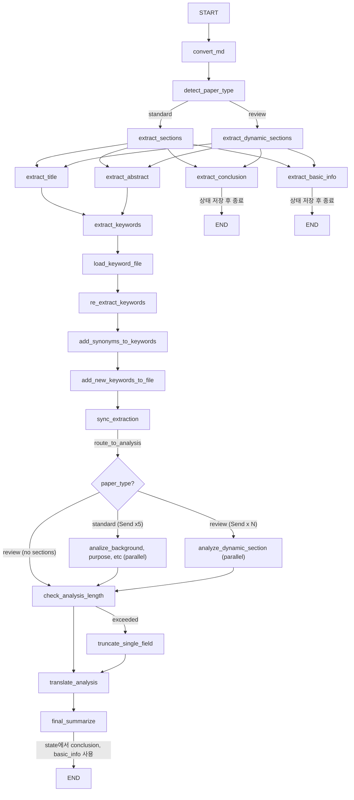

```mermaid
flowchart TD
    START --> convert_md
    convert_md --> detect_paper_type
    detect_paper_type -->|standard| extract_sections
    detect_paper_type -->|review| extract_dynamic_sections
    
    extract_sections --> extract_title
    extract_sections --> extract_abstract
    extract_sections --> extract_conclusion
    extract_sections --> extract_basic_info
    
    extract_dynamic_sections --> extract_title
    extract_dynamic_sections --> extract_abstract
    extract_dynamic_sections --> extract_conclusion
    extract_dynamic_sections --> extract_basic_info
    
    extract_title --> extract_keywords
    extract_abstract --> extract_keywords
    extract_keywords --> load_keyword_file
    load_keyword_file --> re_extract_keywords
    re_extract_keywords --> add_synonyms_to_keywords
    add_synonyms_to_keywords --> add_new_keywords_to_file
    add_new_keywords_to_file --> sync_extraction
    
    extract_conclusion -->|"상태 저장 후 종료"| END_NODE1[END]
    extract_basic_info -->|"상태 저장 후 종료"| END_NODE2[END]
    
    sync_extraction -->|"route_to_analysis"| analysis_decision{"paper_type?"}
    
    analysis_decision -->|"standard (Send x5)"| standard_analyzers["analize_background, purpose, etc (parallel)"]
    analysis_decision -->|"review (Send x N)"| analyze_dynamic_section["analyze_dynamic_section (parallel)"]
    analysis_decision -->|"review (no sections)"| check_analysis_length
    
    standard_analyzers --> check_analysis_length
    analyze_dynamic_section --> check_analysis_length
    
    check_analysis_length --> translate_analysis
    check_analysis_length -->|exceeded| truncate_single_field
    truncate_single_field --> translate_analysis
    
    translate_analysis --> final_summarize
    final_summarize -->|"state에서 conclusion, basic_info 사용"| END_NODE3[END]
```